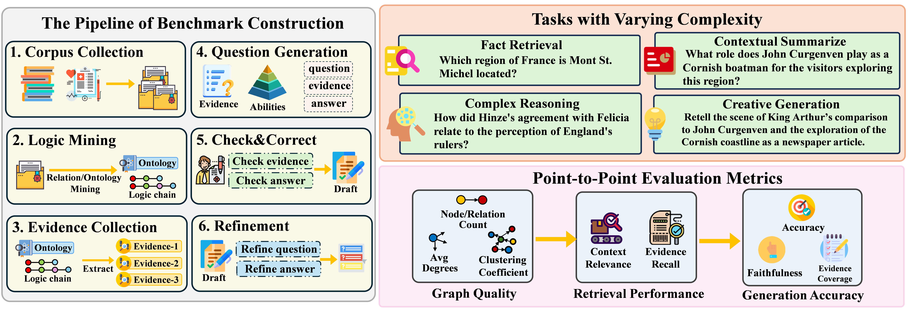
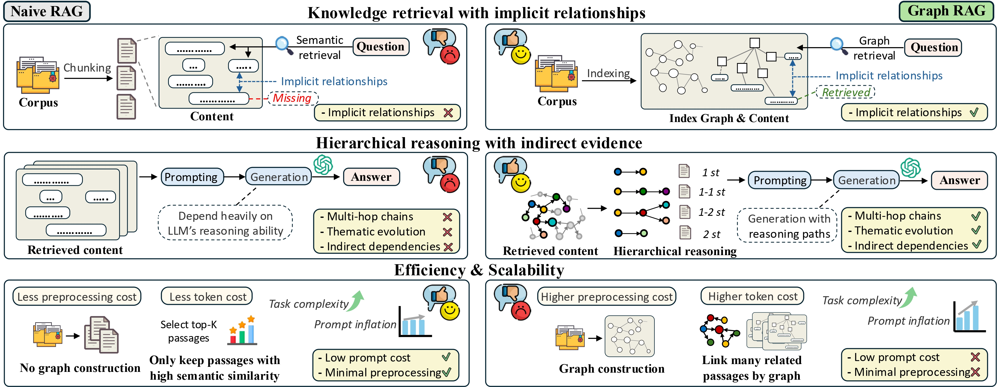

# GraphRAG-Bench Website

This repository hosts the official website for the GraphRAG-Bench project, a comprehensive benchmark for evaluating Graph Retrieval-Augmented Generation models.


## Website Overview

### 🎉 News
- **[2025-05-25]** [Leaderboard](https://graphrag-bench.github.io) is on!

### 📖 About
- Introduces Graph Retrieval-Augmented Generation (GraphRAG) concept
- Compares traditional RAG vs GraphRAG approach
- Explains research objective: Identify scenarios where GraphRAG outperforms traditional RAG
- Visual comparison diagram of RAG vs GraphRAG




### 🏆 Leaderboards
Two domain-specific leaderboards with comprehensive metrics:

**1. GraphRAG-Bench (Novel)**
- Evaluates models on literary/fictional content

**2. GraphRAG-Bench (Medical)**
- Evaluates models on medical/healthcare content

**Evaluation Dimensions:**
- Fact Retrieval (Accuracy, ROUGE-L)
- Complex Reasoning (Accuracy, ROUGE-L)
- Contextual Summarization (Accuracy, Coverage)
- Creative Generation (Accuracy, Factual Score, Coverage)

### 🧩 Task Examples
Four difficulty levels with representative examples:

**Level 1: Fact Retrieval**  
*Example: "Which region of France is Mont St. Michel located?"*

**Level 2: Complex Reasoning**  
*Example: "How did Hinze's agreement with Felicia relate to the perception of England's rulers?"*

**Level 3: Contextual Summarization**  
*Example: "What role does John Curgenven play as a Cornish boatman for visitors exploring this region?"*

**Level 4: Creative Generation**  
*Example: "Retell King Arthur's comparison to John Curgenven as a newspaper article."*

### 📬 Contact
- Project email: [GraphRAG@hotmail.com](mailto:GraphRAG@hotmail.com)

## Access the Website
Our benchmark was released:  
[**https://graphrag-bench.github.io**](https://graphrag-bench.github.io)

## Getting Started
```bash
git clone https://github.com/GraphRAG-Bench/GraphRAG-Bench.git](https://github.com/GraphRAG-Bench/GraphRAG-Benchmark.git
cd GraphRAG-Benchmark
# Open index.html in browser
```

## Contribution
Contributions to improve the benchmark website are welcome. Please contact the project team via email.
